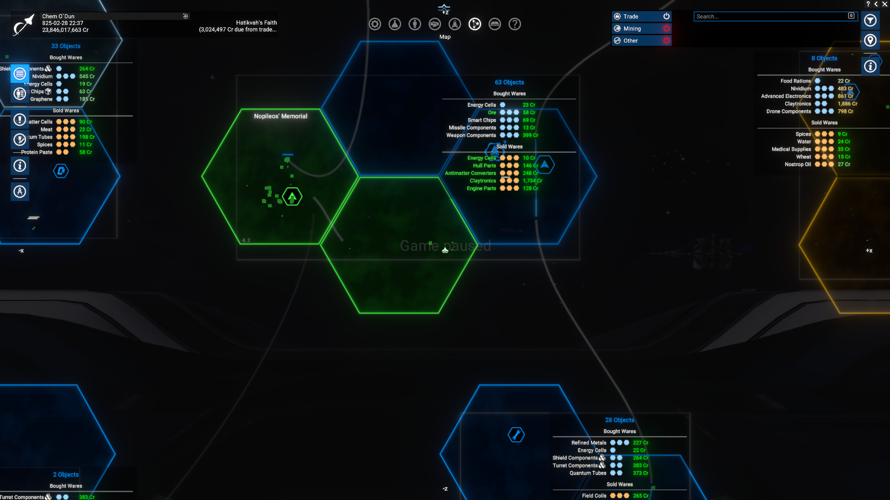
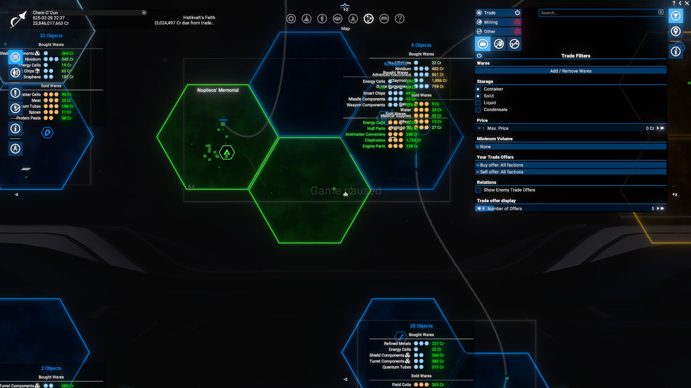
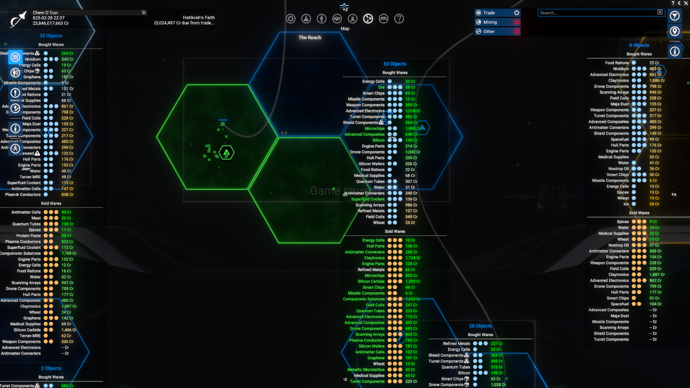

# Show Me More Trade Offers

A handy Quality-of-life mod that lets you see more trade offers at once in Map mode...

## Features

- Simply expand a maximum number of trade offers shown in Map mode from default `5` to `50`.

## Limitations

- Available only from game version `8.00HF3` and newer, due to reliance on `Kuertee UI Extensions` mod.

## Requirements

- `X4: Foundations` 8.00HF3 or newer.
- `UI Extensions and HUD` by [kuertee](https://next.nexusmods.com/profile/kuertee?gameId=2659) to be installed and enabled. Version `8.035` and upper is required.
  - It is available only via the Nexus Mods - [UI Extensions and HUD](https://www.nexusmods.com/x4foundations/mods/552)
- `Mod Support APIs` by [SirNukes](https://next.nexusmods.com/profile/sirnukes?gameId=2659) to be installed and enabled. Version `1.95` and upper is required.
  - It is available via Steam - [SirNukes Mod Support APIs](https://steamcommunity.com/sharedfiles/filedetails/?id=2042901274)
  - Or via the Nexus Mods - [Mod Support APIs](https://www.nexusmods.com/x4foundations/mods/503)

## Installation

You can download the latest version via Steam client - [Show Me More Trade Offers](https://steamcommunity.com/sharedfiles/filedetails/?id=3624666582)
Or you can do it via the Nexus Mods - [Show Me More Trade Offers](https://www.nexusmods.com/x4foundations/mods/)

## Usage

No special actions required. Just open the Map mode and then edit maximum number of trade offers shown in Trade Filters menu/panel.

- Trade offers limited by default maximum value:
  
- Trade Filters menu with updated maximum value:
  
- Trade offers are restricted to a suitable value, though not the maximum:
  

## Video

[Video demonstration of the Version 1.00](https://www.youtube.com/watch?v=ml6-xKt50QA)

## Credits

- Author: Chem O`Dun, on [Nexus Mods](https://next.nexusmods.com/profile/ChemODun/mods?gameId=2659) and [Steam Workshop](https://steamcommunity.com/id/chemodun/myworkshopfiles/?appid=392160)
- *"X4: Foundations"* is a trademark of [Egosoft](https://www.egosoft.com).

## Acknowledgements

- [EGOSOFT](https://www.egosoft.com) — for the X series.
- [SirNukes](https://next.nexusmods.com/profile/sirnukes?gameId=2659) — for the `Mod Support APIs` that power the UI hooks.
- [kuertee](https://next.nexusmods.com/profile/kuertee?gameId=2659) — for his exciting `UI Extensions and HUD` that makes this extension possible.
- [Forleyor](https://next.nexusmods.com/profile/Forleyor?gameId=2659) — for his constant help with understanding the UI modding!

## Changelog

### [1.00] - 2025-12-15

- Added
  - Initial public version
